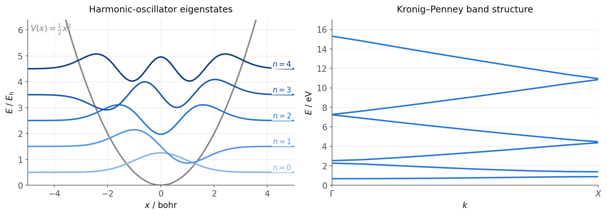

# Numerov.jl

Numerov.jl solves the time-independent Schrödinger equation on 1D, 2D and 3D
grid potentials — for example, vibrational eigenstates of molecules on
potential-energy surfaces from electronic-structure calculations, or periodic
model systems with k-point sampling and band structures along paths through the
high-symmetry points of the Brillouin zone.

Under the hood, the Hamiltonian is discretized with high-order finite-difference
(Numerov-type) stencils, assembled as a sparse matrix and diagonalized with
iterative eigensolvers (Arpack, KrylovKit) or a dense LU-based solver.



*Left: the five lowest eigenstates of a 1D harmonic oscillator, computed from
`examples/1DHarmonicOscillator`. Right: the band structure of a 1D Kronig-Penney
model from `examples/1DKronigPenney`.*

## Installation

Requires Julia 1.10 or later. Numerov.jl is registered in the Julia General
registry:

```julia-repl
pkg> add Numerov
```

## Quickstart

Numerov.jl has a single entry point: the exported function
[`numerov`](@ref) reads an input file, solves the Schrödinger equation and
writes all result files to the current working directory. On invalid input it
throws a catchable `ArgumentError` rather than terminating Julia.

```julia-repl
julia> using Numerov

julia> numerov("input.in")
```

The input file names a grid-potential file and sets calculation options — see
the [input file reference](input.md). Ready-to-run cases live in the
[`examples/`](https://github.com/MolarVerse/Numerov.jl/tree/main/examples)
directory of the repository, and a [command-line interface](cli.md) is
available as well.

## Output files

All output files are written to the current working directory; existing files
with the same names are overwritten on each run (`eigenvalues.dat` is deleted
as soon as a run starts, since it is appended to per k-point).

| File | Content | Written |
| --- | --- | --- |
| `Numerov.out` | Log file: input parsing, system and sparse-matrix information (name configurable via `output-file`) | always |
| `eigenvalues.dat` | Eigenvalues in the chosen `potential-unit`, one line per k-point (k-point columns first for periodic runs) | always |
| `eigenvectors.dat`, `eigenvectors_shifted.dat` | Coordinates, potential and eigenvector amplitudes per grid point; the `shifted` variant offsets each eigenvector by its eigenvalue for plotting inside the potential | non-periodic runs |
| `eigenvectors_k_<k>.dat`, `eigenvectors_shifted_k_<k>.dat`, `imag_eigenvectors_k_<k>.dat`, `imag_eigenvectors_shifted_k_<k>.dat` | Real and imaginary parts of the (complex) eigenvectors, one set of files per k-point | periodic/k-point runs |
| `frequencies.dat` (or `frequencies_k_<k>.dat`) | Transition energies between the computed states as a lower triangular matrix, in `cm⁻¹` | always (per k-point for periodic runs) |
| `bandstructure.dat` | Distance along the k-path and the corresponding eigenvalues | only with `band-structure = on` |
| `timings.out` | Timing breakdown of the calculation (name configurable via `timings-file`) | always |

## Citing

If you use Numerov.jl in your research, please cite the repository — citation
metadata is provided in
[`CITATION.cff`](https://github.com/MolarVerse/Numerov.jl/blob/main/CITATION.cff).
